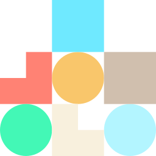

<div align="center">



</div>
<h1 align="center">Oslo Designsystem</h1>

<div align="center">


[](https://opensource.org/licenses/MIT)
[](https://developer.mozilla.org/en-US/docs/Web/JavaScript)
[](https://v2.vuejs.org/)
[](https://sass-lang.com/)

</div>

Welcome to `Oslo Designsystem` a complete library for styles and components used in Oslo kommune.

## 📚 Table of Contents

- **🎯 [Description](#-description)**
- **🚀 [Installation](#-installation)**
- **📑 [Documentation](#-documentation)**
- **🤝 [Contribution Guidelines](#-contribution)**
- **📜 [License](#-license)**
- **📬 [Contact](#-contact)**

## 🎯 Description

`Oslo Designsystem` is a collection of reusable components, guided by clear standards. Designed with functionality, accessibility and aesthetic in mind, it serves as a unifying building block for all projects in Oslo kommune.

## 🚀 Installation

```bash
npm install @oslokommune/oslo-designsystem
```

## 📑 Documentation

Please take a look at the [documentation](https://designsystem.oslo.kommune.no/#/getting_started-basics) if you want a complete understanding on how to use `Oslo Designsystem`.

## 🤝 Contribution

If you would like to contribute to this project, please take a look at our [contribute](https://designsystem.oslo.kommune.no/#/getting_started-contribute-basics) page for more information.

## 📜 License

Oslo Designsystem is distributed under a MIT-license for open source code.

[](https://opensource.org/licenses/MIT)

## 📬 Contact

Slack: [Oslo kommune](https://oslokommune.slack.com)

Join the #oslodesignsystem channel

devnull@uke.oslo.kommune.no

[Github - Oslo Designsystem](https://github.com/oslokommune/ukeweb_designsystem)

Made with ♥ by </br>
Team Devnull @ Utviklings- og kompetanseetaten
